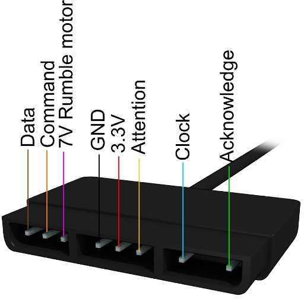

# Nano Apple IIe

The Nano Apple IIe is a port of both [MiSTer](https://github.com/MiSTer-devel/Apple-II_MiSTer) and [MiST](https://github.com/gyurco/apple2efpga) FPGA core components for the [Apple IIe](https://en.wikipedia.org/wiki/Apple_IIe) computer:  

| Board      | FPGA       | support |Note|
| ---        |        -   | -     |-|
| [Tang Nano 20k](https://wiki.sipeed.com/nano20k)     | [GW2AR](https://www.gowinsemi.com/en/product/detail/38/)  |HDMI | |
| [Tang Console 60K NEO](https://wiki.sipeed.com/hardware/en/tang/tang-console/mega-console.html)|[GW5AT-60](https://www.gowinsemi.com/en/product/detail/60/) | HDMI / LCD ||
| [Tang Mega 60k NEO](https://wiki.sipeed.com/hardware/en/tang/tang-mega-60k/mega-60k.html)|[GW5AT-60](https://www.gowinsemi.com/en/product/detail/60/)| HDMI / LCD| |

**The project is still a work in progress. Please report findings as issue.**  

This project relies on an external µC being connected to the Tang Nano 20K. You can use a [M0S Dock BL616](https://wiki.sipeed.com/hardware/en/maixzero/m0s/m0s.html), [Raspberry Pi Pico (W)](https://www.raspberrypi.com/documentation/microcontrollers/pico-series.html) or [esp32-s2](https://www.espressif.com/en/products/socs/esp32-s2)/[s3](https://www.espressif.com/en/products/socs/esp32-s3) and use the [FPGA companion firmware](http://github.com/harbaum/FPGA-Companion). Basically a µC acts as USB host for USB devices and as an OSD controller using a [SPI communication protocol](https://github.com/harbaum/MiSTeryNano/blob/main/SPI.md).

For the [M0S Dock BL616](https://wiki.sipeed.com/hardware/en/maixzero/m0s/m0s.html) there is a:

* [Optional custom carrier board MiSTeryShield20k](https://github.com/harbaum/MiSTeryNano/tree/main/board/misteryshield20k/README.md)
* [Optional case](https://github.com/harbaum/MiSTeryNano/blob/main/board/misteryshield20k/housing3D)
* [Dualshock Adapter / Cable](https://github.com/vossstef/tang_nano_20k_c64/tree/main/board/misteryshield20k_ds2_adapter/misteryshield20k_ds2_adapter_cable.md)

and for the Raspberry PiPico (RP2040 µC) there is a:

* [Optional custom carrier board MiSTeryShield20k Raspberry PiPico](https://github.com/vossstef/tang_nano_20k_c64/tree/main/board/misteryshield20k_rpipico/README.md)
* [Dualshock Adapter / Cable](https://github.com/vossstef/tang_nano_20k_c64/tree/main/board/misteryshield20k_ds2_adapter/misteryshield20k_ds2_adapter_cable.md)
* [Optional custom PMOD RP2040-Zero](https://github.com/vossstef/tang_nano_20k_c64/tree/main/board/pizero_pmod/README.md) for Primer / Mega / Console Boards
* Optional case (upcoming)  

The project based on an Apple ][+ FPGA implementation.  
Original for the DE2: http://www1.cs.columbia.edu/~sedwards/apple2fpga/  
Port for the MiST: http://ws0.org/tag/apple2/  

All HID, SDcard and µC firmware by [Till Harbaum](http://www.harbaum.org/till/mist)  

Features:
* HDMI Video and Audio Output
* TFT-LCD module 800x600 [SH500Q01Z](https://dl.sipeed.com/Accessories/LCD/500Q01Z-00%20spec.pdf) + Speaker support
* [USB Keyboard](https://en.wikipedia.org/wiki/Computer_keyboard)
* [USB Gamepad](https://en.wikipedia.org/wiki/Gamepad)
* [USB XBOX 360 Controller](https://en.wikipedia.org/wiki/Xbox_360_controller)
* [Dualshock 2 Controller Gamepad](https://en.wikipedia.org/wiki/DualShock) for [MiSTeryShield20k / MiSTeryShield20kPico](https://github.com/harbaum/MiSTeryNano/tree/main/board/misteryshield20k/README.md) via spare [pinheader](/board/misteryshield20k_ds2_adapter/misteryshield20k_ds2_adapter_cable.md)
* [USB Mouse](https://en.wikipedia.org/wiki/Computer_mouse)
* Disk loading via OSD. supported formats: **.NIB**
* HDD loading via OSD. supported formats: **.HDV** (raw ProDOS partition images, 32MB)
* Selectable 6502 or 65C02 CPU
* Joystick support (analog proportional)
* Mouse card in slot 5
* Scanlines
* Monitor type: Color, amber, green and black&white
* Selection of color palette (NTSC //e, Apple IIgs, AppleWin, Custom)
* Language card in slot 0
* Super Serial Card (SSC) in slot 2
* 64K base + 64K auxilary RAM with 80 column and double hi-res support
* Mockingboard model A (two AY-3-8913 chips for six audio channels) in slot 4
* Video ROM Switch (US /UK)
* Loadable 8K custom Video ROM
* SSC configuartion
* Tape loading via the UART RX pin
* Selectable mixed mode text color artifacts
* FPGA Companion WIFI modem via SSC

Planned features:
* Tang Mega 138k Pro, Primer 25k support


> [!TIP]
> Be aware that this core loads **.NIB** Disk Drive images only identical to the MIST core.  
> On the fly conversion from .DSK as the MISTer core is doing using Linux host system is not supported. 

## Tang Console 60k NEO

See [Tang Console 60K NEO](TANG_CONSOLE_60K.md)

## Tang Mega 60k NEO

See [Tang Mega 60K NEO](TANG_MEGA_60K.md)

## Installation

The installation on the Tang Nano 20k board can be done using a Linux PC or a Windows PC
[Instruction](INSTALLATION_WINDOWS.md).  

### Keyboard

* Win/Cmd Key - Closed Apple
* Alt Key - Open Apple
* Key **F2** toggle ```RESET```
* Key **F12** OSD

## Push Button utilization

* S1 reserved
* S2 open OSD

## Apple II slot assignments

* Slot 0 - language card (memory expansion)
* Slot 1 - not populated
* Slot 2 - Super Serial Card (SSC)
* Slot 3 - 80 col + 64K RAM expansion (//e)
* Slot 4 - Mockinboard model A (six audio channels)
* Slot 5 - Mouse Card
* Slot 6 - Disk Drive controller
* Slot 7 - Hard Disk Drive controller

## Disk format notes

On the "Apple //e" boot screen open the OSD with F12 and choose a nibblelized disk. It will boot
the disk automatically. Use dsk2nib to convert AppleII disk images to .nib images.  

For HDD, only HDV images (raw ProDOS partition images) 32MB in size are supported.  
A Cold Reset is needed to boot from HDD.
2MG images may work if the 64-byte header is removed.
```bash
dd if=diskimage.2mg of=diskimage.hdv bs=64 skip=1
```

## Instructions

On the "Apple ][" boot screen open the OSD with F12 and choose a disk. It will boot the disk automatically. 

If you press reset you'll enter Applesoft with the ] prompt.
From here you have some limited commands. See: http://www.landsnail.com/a2ref.htm.
CAT

If you want to boot another disk choose a .nib image via the osd and type the following:

```
]PR#6
```

or

```
]CALL -151`
*C600G
```

The HDD interface is in slot 7. Unlike the floppy interface, it does not stall until an image is mounted, so either cold reset the machine or use one of the following after mounting an image:

```
]PR#7
```

or

```
]CALL -151`
*C700G
```

## OSD

invoke by F12 keypress

* Reset
* Cold Reset
* Audio Volume + / -
* Scanlines effect %
* Monitor type
* Color Palette
* SSC, HDD, MB, MOUSE disable/ enable
* CPU type
* HID device selection for Joystick Port
* Invert Joystick X/Y
* Video ROM switch
* SSC Baudrate, Parity, Mode

## Gamecontrol support

  

USB Joystick(s) or Gamepad(s) Stick as Joystick (no DPAD). OSD: **USB #1** or **USB #2**  
```Button A and B``` Buttons as Trigger:  

or  
Dualshock 2 Gamepad Stick as Joystick. OSD: **DS #1** or **DS #2**<br>
<br>```square and cross``` Buttons as Trigger:<br>

> [!IMPORTANT]
> In a [MiSTeryShield20k](https://github.com/harbaum/MiSTeryNano/tree/main/board/misteryshield20k) configuration Dualshock is supported via the ``spare J8`` pinheader. <br>
> See [MiSTeryShield20k DS2 Adapter / Cable](/board/misteryshield20k_ds2_adapter/misteryshield20k_ds2_adapter_cable.md) for further information. Thx [venice1200](https://github.com/venice1200) !<br>

> [!NOTE]
> TN20k: You have to select OSD "DS2 **#2** Joy" for a ``MiSTeryShield20k`` configuration.  
> TN20k: You have to select OSD "DS2 **#1** Joy" if you use the ``Sipeed Joy to DIP`` adapter.  

## LED UI

| LED | function         |TN9K  |TN20K |TP20K  |TP25K  |TM60K   |TM138k|Console60k|
| --- |        -         |-     |-     |-      | -     | -      | -    |-         |
| 0   | unsupported      |-     |-     |-      | x     | x      | x    |-         |
| 1   | FDD              |-     |-     |-      | x     | x      | x    |-         |
| 2   | FDD              |-     |x     |-      | -     | -      | -    |x         |

**Multicolor RGB LED**

* **<font color="green">green</font>**&ensp;&thinsp;&ensp;&thinsp;&ensp;&thinsp;all fine and ready to go<br>
* **<font color="red">red</font>**&ensp;&thinsp;&ensp;&thinsp;&ensp;&thinsp;&ensp;&thinsp;&ensp;&thinsp;something wrong with SDcard / default boot image<br>
* **<font color="blue">blue</font>**&ensp;&thinsp;&ensp;&thinsp;&ensp;&thinsp;&ensp;&thinsp;µC firmware detected valid FPGA core<br>
* **<font color="yellow">yellow</font>**&ensp;&thinsp;&ensp;&thinsp;&ensp;&thinsp;FPGA core can't detect valid firmware<br>
* **white**&ensp;&thinsp;&ensp;&thinsp;&ensp;&thinsp;-<br>

## Powering

Circuit with Keyboard can be powered by Tang USB-C connector from PC or a Power Supply Adapter.

## Synthesis

Source code can be synthesized, fitted and programmed with GOWIN IDE Windows or Linux.  
Alternatively use the command line build script **gw_sh.exe** build_tn20k.tcl  

## HW circuit considerations

**Pinmap TN20k Interfaces**  

 Sipeed M0S Dock and DualShock Gamepad connection.  


**Pinmap Dualshock 2 Controller Interface**  



| DS pin | Tang Nano pin | FPGA pin | DS Function |
| ----------- | ---   | --------  | ----- |
| 1 | J5 18 | 71 MISO | JOYDAT  |
| 2 | J5 19 | 53 MOSI  | JOYCMD |
| 3 | n.c. | - | 7V5 |
| 4 | J5 15 | - | GND |
| 5 | J5 16| - | 3V3 |
| 6 | J5 17 | 72 CS | JOYATN|
| 7 | J5 20 | 52 MCLK | JOYCLK |
| 8 | n.c. | - | JOYIRQ |
| 9 | n.c. | - | JOYACK |

